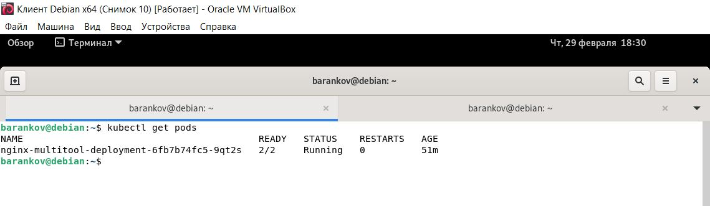
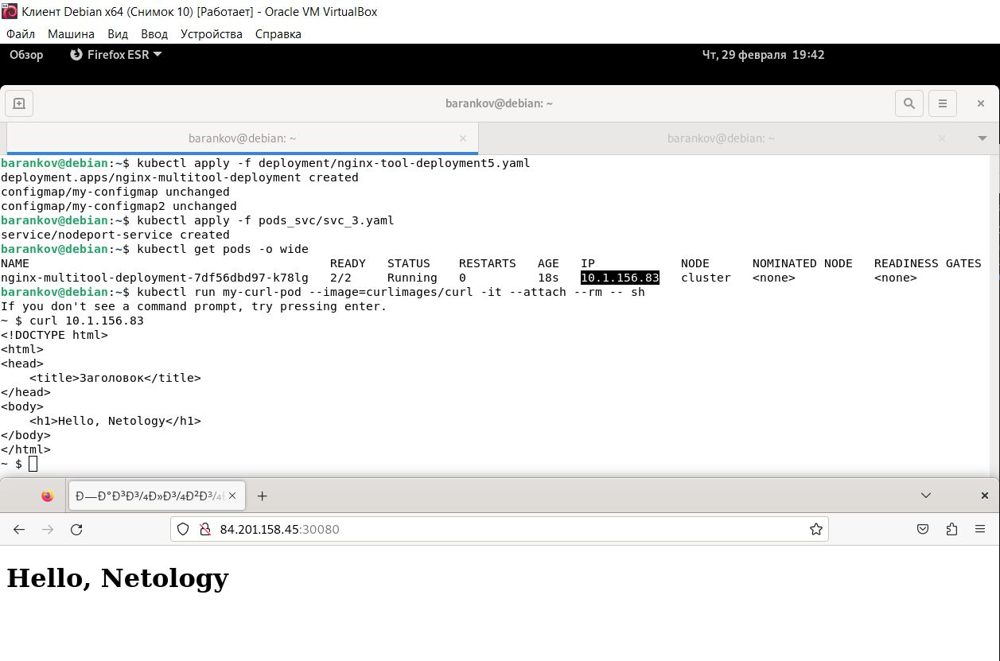
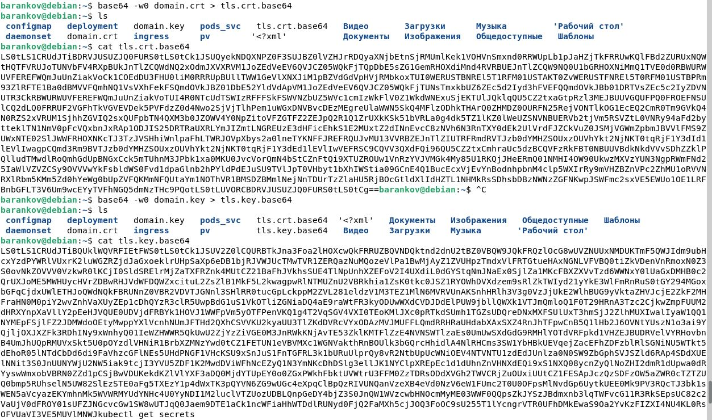
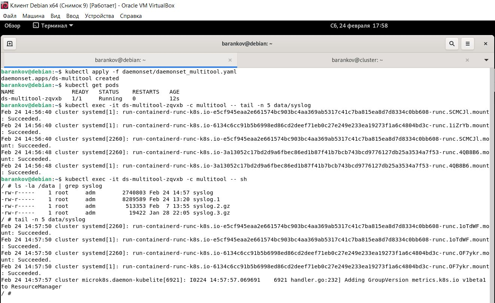

# Домашнее задание к занятию "8. Конфигурация приложений" - Баранков Антон"

### Задание 1.
1. Создать Deployment приложения, состоящего из контейнеров nginx и multitool.  
2. Решить возникшую проблему с помощью ConfigMap.  
3. Продемонстрировать, что pod стартовал и оба конейнера работают.  

  

[Файл deployment](img/1/nginx-tool-deployment3.yaml)  

4. Сделать простую веб-страницу и подключить её к Nginx с помощью ConfigMap. Подключить Service и показать вывод curl или в браузере.  
5. Предоставить манифесты, а также скриншоты или вывод необходимых команд.  

  

[Файл deployment](img/1/nginx-tool-deployment5.yaml)  
[Файл service](img/1/svc_3.yaml)  

### Задание 2
1. Создать Deployment приложения, состоящего из Nginx.
2. Создать собственную веб-страницу и подключить её как ConfigMap к приложению.
3. Выпустить самоподписной сертификат SSL. Создать Secret для использования сертификата.
4. Создать Ingress и необходимый Service, подключить к нему SSL в вид. Продемонстировать доступ к приложению по HTTPS.
5. Предоставить манифесты, а также скриншоты или вывод необходимых команд.

[Файл deployment](img/2/nginx-deployment2.yaml)  
[Файл ingress и service](img/2/ingress2.yaml)

