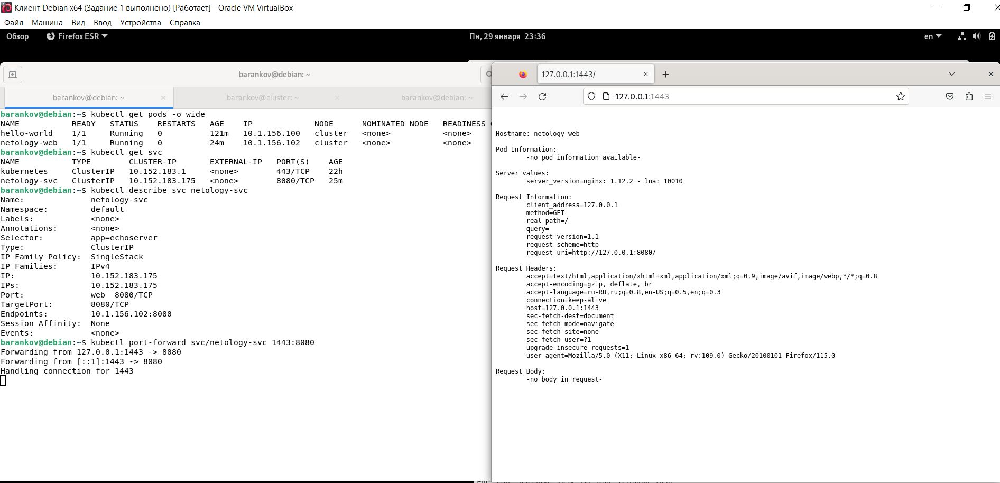
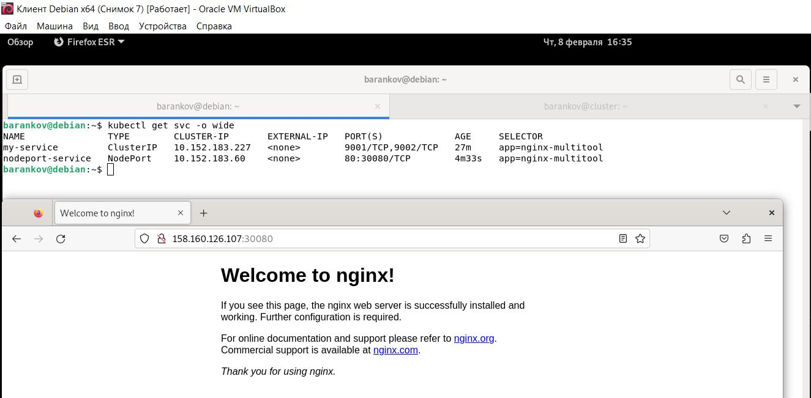
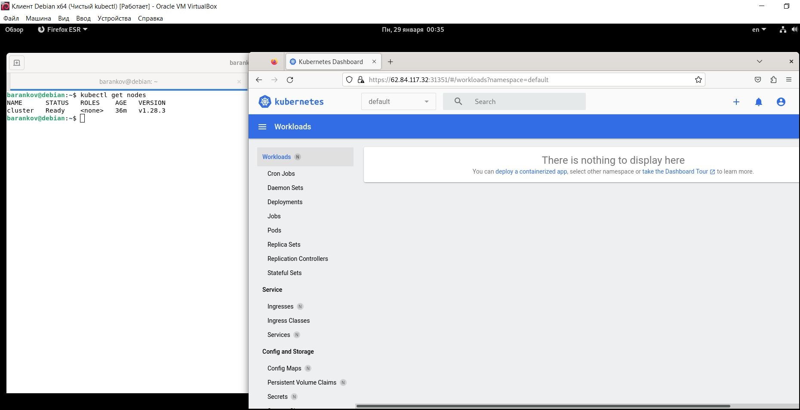

# Домашнее задание к занятию "1.Kubernetes. Причины появления. Команда kubectl" - Баранков Антон"

### Задание 1.
1. Установить MicroK8S на локальную машину или на удалённую виртуальную машину.
2. Установить dashboard.
3. Сгенерировать сертификат для подключения к внешнему ip-адресу.  

### Задание 2
1. Установить на локальную машину kubectl.
2. Настроить локально подключение к кластеру.
3. Подключиться к дашборду с помощью port-forward.  

В связи с тем, что в Крыму запрещен доступ к сайту https://dl.k8s.io и к сайту, указанному в задании для установки kubectl, то пришлось в яндекс облаке создать сервер, находящийся в Москве. А далее через vpn уже подключать локальную машину и затем устанавливать kubectl, поэтому на скриншоте ниже два сервера.

Также попробовал подключиться к dashboard без использования команды port-forward, а путем редактирования конфигурации службы kubernetes-dashboard, а именно, замены  type: clusterIP на NodePort.

