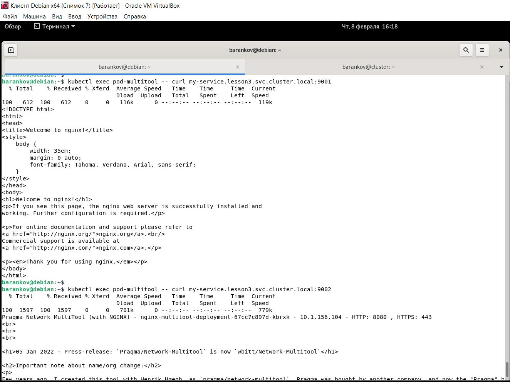

# Домашнее задание к занятию "9. Управление доступом" - Баранков Антон"

### Задание 1.
1. Создайте и подпишите SSL-сертификат для подключения к кластеру.
2. Настройте конфигурационный файл kubectl для подключения.
3. Создайте роли и все необходимые настройки для пользователя.
4. Предусмотрите права пользователя. Пользователь может просматривать логи подов и их конфигурацию (kubectl logs pod <pod_id>, kubectl describe pod <pod_id>).
5. Предоставьте манифесты и скриншоты и/или вывод необходимых команд.

```
openssl genrsa -out oleg.key 2048
openssl req -new -key oleg.key -out oleg.csr -subj "/CN=oleg/O=ops"
openssl x509 -req -in oleg.csr -CA ca.crt -CAkey ca.key -CAcreateserial -out oleg.crt -days 30
kubectl config set-credentials oleg --client-certificate oleg.crt --client-key oleg.key --embed-certs=true
kubectl config set-context oleg_context --cluster=microk8s-cluster --user=oleg
```
[Файл role1.yaml](img/role1.yaml)  


