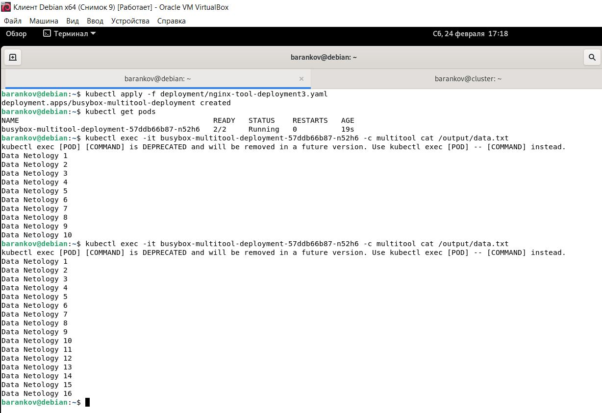
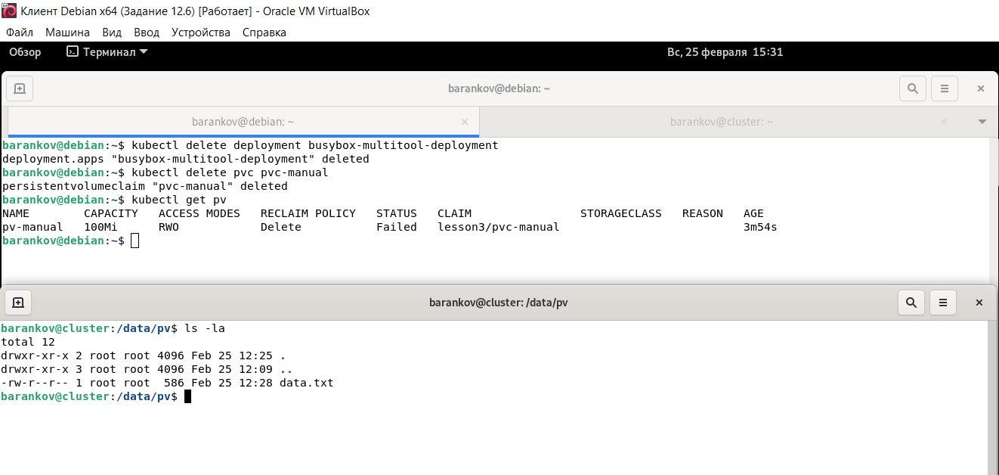
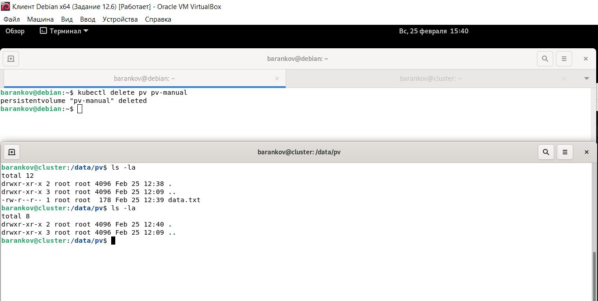
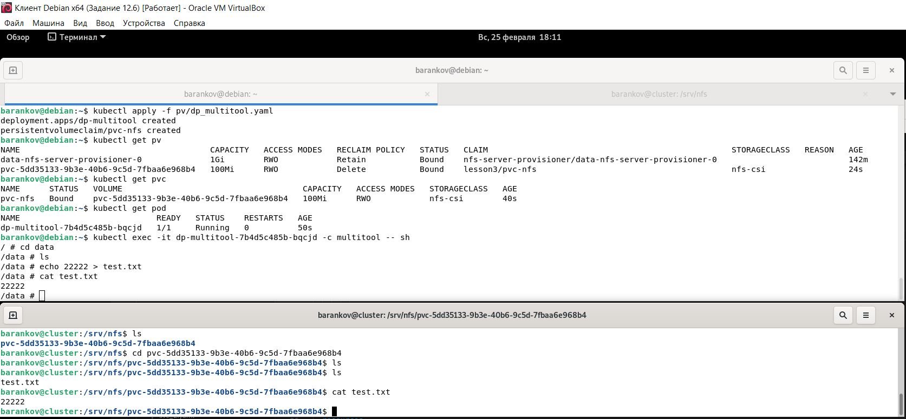

# Домашнее задание к занятию "7. Хранение в K8s. Часть 2" - Баранков Антон"

### Задание 1.
1. Создать Deployment приложения, состоящего из контейнеров busybox и multitool.  
2. Создать PV и PVC для подключения папки на локальной ноде, которая будет использована в поде.  
3. Продемонстрировать, что multitool может читать файл, в который busybox пишет каждые пять секунд в общей директории.  

  

4. Удалить Deployment и PVC. Продемонстрировать, что после этого произошло с PV. Пояснить, почему.  

PV является хранилищем и не удаляется автоматически, т.к. затем может быть перепривязан к новому PVC.  

5. Продемонстрировать, что файл сохранился на локальном диске ноды. Удалить PV. Продемонстрировать что произошло с файлом после удаления PV. Пояснить, почему.  

Файл удалился после удаления PV, т.к. в манифесте указано persistentVolumeReclaimPolicy: Recycle, т.е. автоматическое удаление ресурсов после удаления PV.  

6. Предоставить манифесты, а также скриншоты или вывод необходимых команд.  

[Файл deployment](img/1/busy-tool-deployment.yaml)  

### Задание 2
1. Включить и настроить NFS-сервер на MicroK8S.  
2. Создать Deployment приложения состоящего из multitool, и подключить к нему PV, созданный автоматически на сервере NFS.  
3. Продемонстрировать возможность чтения и записи файла изнутри пода.  
4. Предоставить манифесты, а также скриншоты или вывод необходимых команд.  

[Файл deployment](img/2/dp_multitool.yaml)
