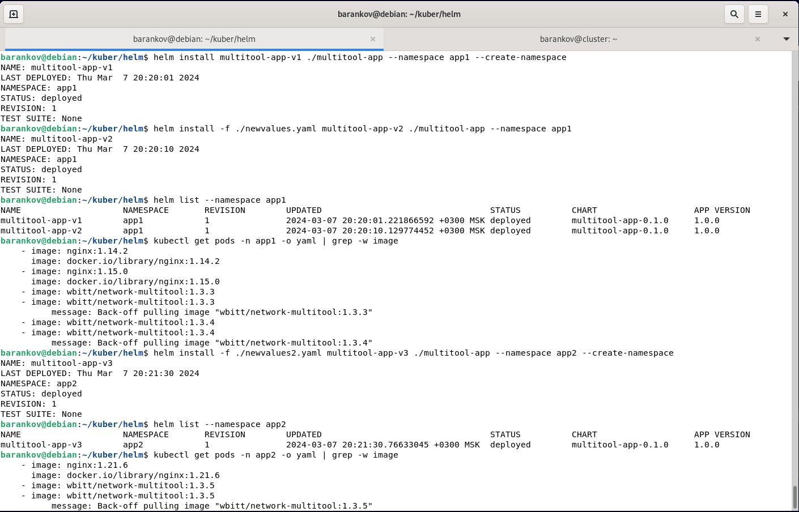

# Домашнее задание к занятию "5. Сетевое взаимодействие в K8S. Часть 2" - Баранков Антон"

### Задание 1.
1. Создать Deployment приложения frontend из образа nginx с количеством реплик 3 шт.  
2. Создать Deployment приложения backend из образа multitool.  
3. Добавить Service, которые обеспечат доступ к обоим приложениям внутри кластера.  
4. Продемонстрировать, что приложения видят друг друга с помощью Service.  
5. Предоставить манифесты Deployment и Service в решении, а также скриншоты или вывод команды п.4.  

  
  
[Файл nginx-deployment](img/1/nginx-deployment.yaml)  
[Файл multitool-deployment](img/1/multitool-deployment.yaml.yaml)  
[Файл service](img/1/svc_2.yaml)  

### Задание 2
1. Включить Ingress-controller в MicroK8S.
2. Создать Ingress, обеспечивающий доступ снаружи по IP-адресу кластера MicroK8S так, чтобы при запросе только по адресу открывался frontend а при добавлении /api - backend.
3. Продемонстрировать доступ с помощью браузера или curl с локального компьютера.
4. Предоставить манифесты и скриншоты или вывод команды п.2.  

[Файл ingress](img/1/ingress1.yaml)
